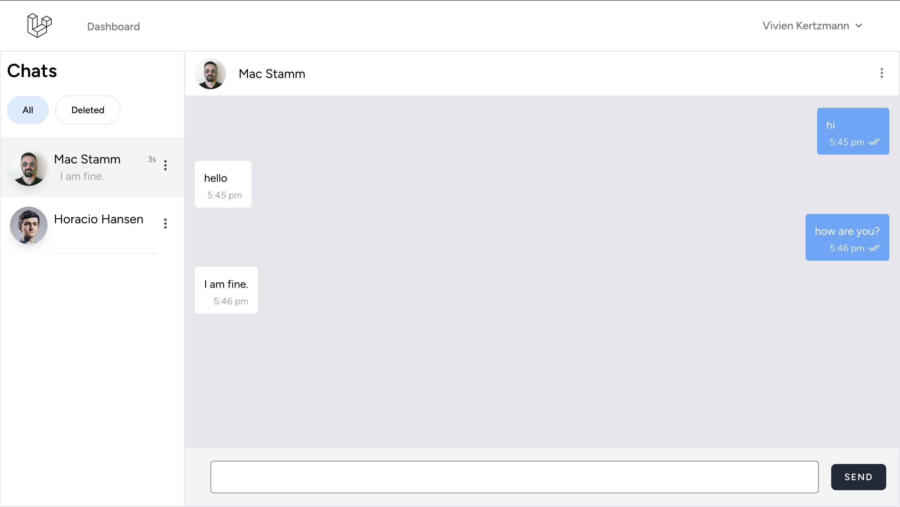

# TALL Stack Chat App


A modern real-time chat application built with the **TALL stack** (TailwindCSS, Alpine.js, Laravel, Livewire). The project demonstrates real-time messaging, user authentication, and conversation management with a responsive user interface.

**Live Demo:**
[https://tall-stack-chat-main-uev0h0.laravel.cloud/](https://tall-stack-chat-main-uev0h0.laravel.cloud/)

-   [View Realtime Messaging Flow](REALTIME_FLOW.md)

---

## Overview

This application showcases how to build a production-ready real-time chat system using Laravel and Livewire, powered by WebSockets. It includes authentication, message delivery, read receipts, and a clean, responsive UI.

---

## Core Features

-   User authentication with Laravel Breeze
-   Real-time one-to-one messaging using Pusher
-   Message read receipts and typing indicators
-   Conversation list with unread message counters
-   Responsive design for mobile and desktop
-   Seeded demo users for testing

---

## Tech Stack

**Backend**

-   Laravel 11
-   Livewire 3 and Livewire Volt
-   Pusher for real-time broadcasting
-   Laravel Queues and Notifications

**Frontend**

-   TailwindCSS
-   Alpine.js
-   Vite

**Database**

-   SQLite (default)
-   MySQL and PostgreSQL supported

---

## Architecture Summary

-   Livewire components manage UI and state
-   Messages are persisted in the database
-   Events are broadcast via Pusher channels
-   Clients receive updates instantly via WebSockets
-   Read status is updated when messages are viewed

---

## Local Setup (Quick Start)

```bash
git clone <repository-url>
cd tall-chat-app

composer install
npm install

cp .env.example .env
php artisan key:generate

php artisan migrate --seed
composer run dev
```

The application will be available at `http://localhost:8000`.

---

## Real-Time and Queue Processing

-   WebSocket broadcasting via Pusher
-   Laravel Echo on the client side
-   Database queue driver
-   Queue worker required for real-time notifications

---

## Deployment

-   PHP 8.2 or higher
-   MySQL, PostgreSQL, or SQLite
-   Pusher credentials for production
-   Docker and Docker Compose supported
-   Production optimization via `php artisan optimize`

---

## Roadmap

-   Group chat support
-   File and image sharing
-   Message search
-   Emoji reactions
-   Dark mode
