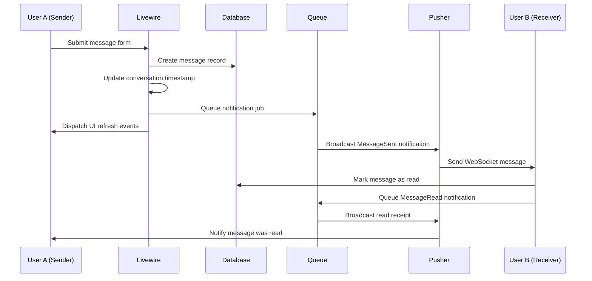
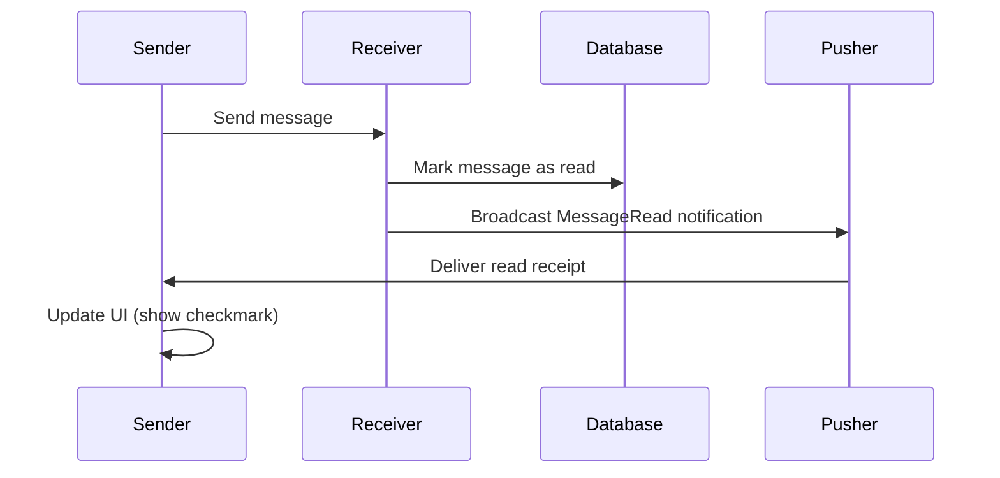

#  Real-Time Flow Documentation
## TALL Stack Chat App - WebSocket & Broadcasting Architecture

  

---

##  Table of Contents

- [ Overview](#-overview)
- [ Architecture Components](#-architecture-components)
- [ Complete Message Flow](#-complete-message-flow)
- [ WebSocket Connection Process](#-websocket-connection-process)
- [ Message Sending Flow](#-message-sending-flow)
- [ Message Receiving Flow](#-message-receiving-flow)
- [ Read Receipt System](#-read-receipt-system)
- [ Notification Broadcasting](#-notification-broadcasting)
- [ Frontend Real-Time Updates](#-frontend-real-time-updates)
- [ Sequence Diagrams](#-sequence-diagrams)
- [ Debugging Real-Time Issues](#-debugging-real-time-issues)

---

##  Overview

The TALL Stack Chat App implements real-time messaging using **Laravel's Broadcasting system** with **Pusher WebSocket** service. The architecture ensures instant message delivery, read receipts, and live UI updates without page refreshes.

###  Key Real-Time Features
- **Instant Message Delivery** via WebSocket
- **Automatic Read Receipts** when messages are viewed
- **Live Conversation Updates** in chat list
- **Optimistic UI Updates** for better user experience
- **Queued Notifications** for reliable delivery

###  Technology Stack
- **Backend**: Laravel 11 + Livewire 3 + Pusher PHP SDK
- **Frontend**: Alpine.js + Laravel Echo + Pusher JS
- **WebSocket**: Pusher Channels (Private Channels)
- **Queue**: Database driver for background processing

---

##  Architecture Components

###  **Broadcasting Components**
```php
┌─────────────────┐    ┌──────────────────┐    ┌─────────────────┐
│   User Action   │───▶│   Livewire       │───▶│   Database      │
│   (Send Message)│    │   Component      │    │   (Store Msg)   │
└─────────────────┘    └──────────────────┘    └─────────────────┘
                                │
                                ▼
┌─────────────────┐    ┌──────────────────┐    ┌─────────────────┐
│   Receiver      │◀───│   Pusher         │◀───│   Notification  │
│   (Real-time)   │    │   WebSocket      │    │   (Queued)      │
└─────────────────┘    └──────────────────┘    └─────────────────┘
```

###  **Core Files Structure**
```
app/
├── Livewire/Chat/
│   ├── MessageForm.php          # Handles message sending
│   ├── Chat.php                 # Manages conversation view
│   └── ChatList.php             # Conversation list management
├── Notifications/
│   ├── MessageSent.php          # Broadcasts new messages
│   └── MessageRead.php          # Broadcasts read receipts
├── Models/
│   ├── User.php                 # User relationships
│   ├── Message.php              # Message model
│   └── Conversation.php         # Conversation model
resources/
├── js/
│   ├── echo.js                  # WebSocket configuration
│   └── bootstrap.js             # Echo initialization
└── views/livewire/chat/
    ├── chat.blade.php           # Chat interface with Alpine.js
    └── message-form.blade.php   # Message input form
routes/
└── channels.php                 # WebSocket channel authorization
```

---

##  Complete Message Flow

###  **Step-by-Step Process**



---

##  WebSocket Connection Process

###  **Connection Initialization**

#### **1. Frontend Setup (`resources/js/echo.js`)**
```javascript
import Echo from "laravel-echo";
import Pusher from "pusher-js";

window.Pusher = Pusher;
window.Echo = new Echo({
    broadcaster: "pusher",
    key: "1dcb7709b5d97f6a6657",      // Pusher App Key
    cluster: "us2",                   // Pusher Cluster
    forceTLS: true,                   // Secure connection
});
```

#### **2. Channel Authorization (`routes/channels.php`)**
```php
// Private channel for user-specific notifications
Broadcast::channel('users.{id}', function ($user, $id) {
    return (int) $user->id === (int) $id;
});

// Laravel model channel for user updates
Broadcast::channel('App.Models.User.{id}', function ($user, $id) {
    return (int) $user->id === (int) $id;
});
```

#### **3. Livewire Component Listeners (`app/Livewire/Chat/Chat.php`)**
```php
public function getListeners()
{
    $auth_id = auth()->user()->id;
    return [
        // Listen to private channel for notifications
        "echo-private:users.{$auth_id},.Illuminate\\Notifications\\Events\\BroadcastNotificationCreated" => 'onBroadcastedNotifications'
    ];
}
```

###  **Security & Authentication**
- **Private Channels**: Only authenticated users can access their channels
- **CSRF Protection**: Laravel's built-in CSRF protection
- **User Verification**: Channel callbacks verify user identity
- **Secure WebSocket**: TLS encryption for all connections

---

##  Message Sending Flow

###  **MessageForm Component Process**

#### **1. User Submits Message (`app/Livewire/Chat/MessageForm.php`)**
```php
public function save()
{
    $this->validate();  // Validate message content
    
    // Step 1: Create message in database
    $createdMessage = Message::create([
        'conversation_id' => $this->selectedConversation->id,
        'sender_id' => auth()->id(),
        'receiver_id' => $this->selectedConversation->getReceiver()->id,
        'body' => $this->body
    ]);
    
    // Step 2: Clear input field
    $this->pull('body');
    
    // Step 3: Dispatch UI refresh events
    $this->dispatch('refresh-messages')->to(Chat::class);
    
    // Step 4: Update conversation timestamp
    $this->selectedConversation->updated_at = now();
    $this->selectedConversation->save();
    
    // Step 5: Refresh chat list
    $this->dispatch('refresh')->to(ChatList::class);
    
    // Step 6: Queue notification for receiver
    $receiver = $this->selectedConversation->getReceiver();
    $receiver->notify(new MessageSent(
        auth()->user(),
        $createdMessage,
        $this->selectedConversation,
        $receiver->id
    ));
}
```

#### **2. Database Operations**
```sql
-- Message insertion
INSERT INTO messages (
    conversation_id, sender_id, receiver_id, body, created_at, updated_at
) VALUES (1, 2, 3, 'Hello there!', '2024-01-20 10:30:00', '2024-01-20 10:30:00');

-- Conversation timestamp update
UPDATE conversations 
SET updated_at = '2024-01-20 10:30:00' 
WHERE id = 1;
```

#### **3. Event Dispatching**
- **`refresh-messages`**: Updates chat component with new message
- **`refresh`**: Refreshes conversation list with latest activity
- **`scroll-bottom`**: Automatically scrolls to newest message

---

##  Message Receiving Flow

###  **Notification Broadcasting (`app/Notifications/MessageSent.php`)**

#### **1. Notification Structure**
```php
class MessageSent extends Notification
{
    use Queueable;
    
    public function via(object $notifiable): array
    {
        return ['broadcast'];  // Only broadcast, no email/database
    }
    
    public function toArray(object $notifiable): array
    {
        return [
            'user_id' => $this->user->id,
            'conversation_id' => $this->conversation->id,
            'message_id' => $this->message->id,
            'receiver_id' => $this->receiverId,
        ];
    }
}
```

#### **2. Receiver Processing (`app/Livewire/Chat/Chat.php`)**
```php
public function onBroadcastedNotifications($event)
{
    if ($event['type'] == MessageSent::class) {
        // Check if notification is for current conversation
        if ($event['conversation_id'] == $this->conversation->id) {
            $newMessage = Message::find($event['message_id']);
            
            // Automatically mark as read (user is viewing conversation)
            $newMessage->read_at = now();
            $newMessage->save();
            
            // Send read receipt back to sender
            $this->conversation->getReceiver()
                ->notify(new MessageRead($this->conversation->id));
            
            // Refresh UI with new message
            $this->refreshMsgs();
        }
    }
}
```

###  **Frontend Real-Time Updates (`resources/views/livewire/chat/chat.blade.php`)**

#### **1. Alpine.js WebSocket Listener**
```javascript
x-init="
    // Initialize Echo listener for private channel
    Echo.private('users.{{ Auth()->User()->id }}')
        .notification((notification) => {
            if (notification['type'] == 'App\\Notifications\\MessageRead' 
                && notification['conversation_id'] == {{ $conversation->id }}) {
                markAsRead = true;  // Update read receipt indicator
            }
        });
"
```

#### **2. Automatic Scrolling**
```javascript
x-on:scroll-bottom.window="
    $nextTick(() => msgContainerElement.scrollTop = msgContainerElement.scrollHeight)
"
```

---

##  Read Receipt System

###  **Read Receipt Flow**



#### **1. Automatic Read Marking (`app/Livewire/Chat/Chat.php`)**
```php
public function mount()
{
    $this->loadMessages();
    
    // Auto-mark messages as read when conversation is opened
    Message::where('conversation_id', $this->conversation->id)
        ->where('receiver_id', auth()->id())
        ->whereNull('read_at')
        ->update(['read_at' => now()]);
}
```

#### **2. Read Receipt Notification (`app/Notifications/MessageRead.php`)**
```php
class MessageRead extends Notification
{
    public function toBroadcast(object $notifiable): BroadcastMessage
    {
        return new BroadcastMessage([
            'conversation_id' => $this->conversation_id,
        ]);
    }
}
```

#### **3. Frontend Read Indicator**
```php
<!-- In message component -->
@if($message->read_at && $isMine)
    <span class="text-xs text-blue-500"> Read</span>
@elseif($isMine)
    <span class="text-xs text-gray-400"> Sent</span>
@endif
```

---

##  Notification Broadcasting

###  **Queue Processing**

#### **1. Queue Configuration (`config/queue.php`)**
```php
'default' => env('QUEUE_CONNECTION', 'database'),

'connections' => [
    'database' => [
        'driver' => 'database',
        'table' => 'jobs',
        'queue' => 'default',
        'retry_after' => 90,
    ],
],
```

#### **2. Background Job Processing**
```bash
# Queue worker processes notifications in background
php artisan queue:work

# Monitor queue status
php artisan queue:monitor
```

#### **3. Notification Reliability**
- **Queued Delivery**: Notifications processed asynchronously
- **Retry Logic**: Failed jobs automatically retried
- **Error Handling**: Failed notifications logged for debugging
- **Graceful Degradation**: App works even if WebSocket fails

###  **Broadcasting Configuration (`config/broadcasting.php`)**
```php
'pusher' => [
    'driver' => 'pusher',
    'key' => env('PUSHER_APP_KEY'),
    'secret' => env('PUSHER_APP_SECRET'),
    'app_id' => env('PUSHER_APP_ID'),
    'options' => [
        'cluster' => env('PUSHER_APP_CLUSTER'),
        'useTLS' => true,
    ],
],
```

---

##  Frontend Real-Time Updates

###  **Livewire Real-Time Features**

#### **1. Component Communication**
```php
// From MessageForm to Chat component
$this->dispatch('refresh-messages')->to(Chat::class);

// From MessageForm to ChatList component  
$this->dispatch('refresh')->to(ChatList::class);

// Browser events for UI updates
$this->dispatch('scroll-bottom');
```

#### **2. Alpine.js Integration**
```javascript
// Auto-scroll to bottom when new message arrives
x-on:scroll-bottom.window="
    $nextTick(() => msgContainer.scrollTop = msgContainer.scrollHeight)
"

// Handle infinite scroll for loading older messages
@scroll="
    if($el.scrollTop <= 0) {
        $dispatch('load-more');
    }
"
```

#### **3. Optimistic UI Updates**
- **Immediate Response**: UI updates before server confirmation
- **Progressive Enhancement**: Works without JavaScript
- **Error Handling**: Rollback if server operation fails
- **Loading States**: Visual feedback during operations

---

##  Sequence Diagrams

###  **Complete Message Exchange**

```
User A (Sender)                 Laravel Backend                 User B (Receiver)
      │                              │                              │
      │ 1. Submit form               │                              │
      ├─────────────────────────────▶│                              │
      │                              │ 2. Save to database         │
      │                              ├─────────────────────────────▶│
      │                              │ 3. Queue notification       │
      │                              ├─────────────────────────────▶│
      │ 4. UI refresh (optimistic)   │                              │
      ◀─────────────────────────────┤                              │
      │                              │ 5. Broadcast via Pusher     │
      │                              ├─────────────────────────────▶│
      │                              │                              │ 6. Receive message
      │                              │                              ├─────────────────▶
      │                              │ 7. Mark as read             │
      │                              ◀─────────────────────────────┤
      │                              │ 8. Broadcast read receipt   │
      │                              ├─────────────────────────────▶│
      │ 9. Show read indicator       │                              │
      ◀─────────────────────────────┤                              │
```

###  **WebSocket Connection Flow**

```
Browser                     Laravel                     Pusher
   │                          │                          │
   │ 1. Load page             │                          │
   ├─────────────────────────▶│                          │
   │ 2. Initialize Echo       │                          │
   ├─────────────────────────▶│                          │
   │                          │ 3. Authenticate channel  │
   │                          ├─────────────────────────▶│
   │                          │ 4. Channel authorized    │
   │                          ◀─────────────────────────┤
   │ 5. WebSocket connected   │                          │
   ◀─────────────────────────┤                          │
   │ 6. Listen for events     │                          │
   ├─────────────────────────▶│                          │
```

---

##  Debugging Real-Time Issues

###  **Common Issues & Solutions**

#### **1. WebSocket Connection Problems**
```bash
# Check Pusher credentials
php artisan tinker
>>> config('broadcasting.connections.pusher')

# Test broadcast manually
>>> broadcast(new App\Notifications\MessageSent(...));
```

#### **2. Queue Job Issues**
```bash
# Check failed jobs
php artisan queue:failed

# Retry failed jobs
php artisan queue:retry all

# Monitor queue in real-time
php artisan queue:work --verbose
```

#### **3. Frontend Debug**
```javascript
// Enable Pusher debugging
window.Pusher.logToConsole = true;

// Check Echo connection
Echo.connector.pusher.connection.state

// Monitor channel subscriptions
Echo.private('users.1').listenForWhisper('typing', (e) => {
    console.log('Typing event:', e);
});
```

#### **4. Laravel Telescope Integration**
```bash
# View real-time requests and broadcasts
php artisan telescope:install
# Visit /telescope to monitor:
# - Broadcast events
# - Queue jobs  
# - Database queries
# - HTTP requests
```

###  **Performance Monitoring**

#### **1. Queue Metrics**
```bash
# Monitor queue performance
php artisan queue:monitor redis:default --max=100

# Check queue size
php artisan horizon:snapshot
```

#### **2. WebSocket Health**
```javascript
// Monitor connection health
Echo.connector.pusher.connection.bind('state_change', function(states) {
    console.log('Connection state:', states.current);
});
```

#### **3. Database Query Optimization**
```php
// Eager load relationships to reduce queries
$conversations = $user->conversations()
    ->with(['messages' => function($query) {
        $query->latest()->limit(1);
    }])
    ->latest('updated_at')
    ->get();
```

---

##  Summary

The TALL Stack Chat App demonstrates a robust real-time messaging architecture that combines:

- **Laravel's Broadcasting** for server-side event management
- **Pusher WebSocket** for reliable real-time communication  
- **Livewire Components** for reactive UI updates
- **Alpine.js** for client-side interactivity
- **Queued Notifications** for scalable background processing

This architecture ensures **instant message delivery**, **automatic read receipts**, and **seamless user experience** while maintaining **scalability** and **reliability** through proper queue management and error handling.

The system gracefully handles network issues, provides visual feedback, and maintains data consistency across all connected clients.
